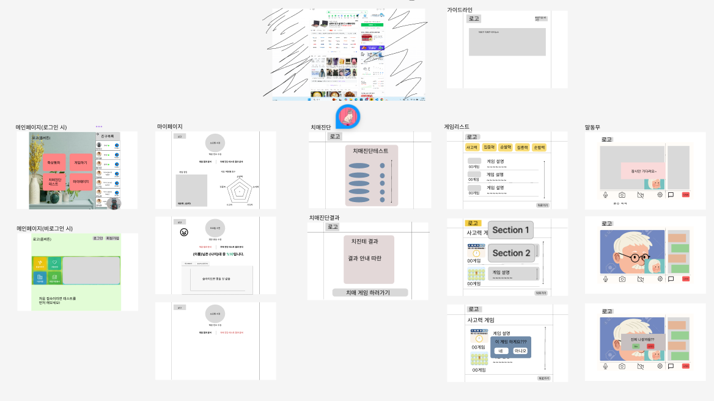

# DAY 1
## WebRTC 개요와 동작 원리
### WebRTC란?
- Web Real-Time Communication의 약자.
- 실시간으로 오디오, 비디오, 텍스트, 파일 등 미디어를 브라우저 간(Peer-to-Peer) 전송하는 오픈 소스 웹 기술.
- 별도의 플러그인 설치 없이 실시간 통신 지원.
- Peer 간 직접 통신이 가능하지만 일부 서버를 활용해 통신 과정 지원.
 

## WebRTC 동작 흐름
1. Signaling Server를 통해 Peer 간 초기 연결 정보를 교환.
2. STUN Server로 공인 IP 주소를 탐지하고 NAT 환경을 우회.
3. 필요한 경우 TURN Server를 통해 트래픽을 중계.
4. 미디어 데이터 전송 방식으로 Mesh, SFU, MCU 중 하나를 선택.
 

## 서버 종류
### Signaling Server

- 역할: Peer 간 연결 정보를 교환(SDP, Codec, Bandwidth 등).
- 프로세스:
Peer A가 Signaling Server에 연결 요청(Offer).
Signaling Server가 Peer B에게 Offer 전달.
Peer B가 Signaling Server에 응답(Answer).
응답이 Peer A에게 전달.
Peer 간 WebRTC 연결 성립.
- 구현: WebRTC와 별개로 직접 구축하며, 주로 WebSocket을 사용.

### STUN Server (Session Traversal Utilities for NAT)

- 역할: 클라이언트의 공인 IP(Public IP)와 포트를 탐지.
- 특징:
정보 제공 목적의 서버로 구현 필요 없음.
Google의 무료 STUN 서버(stun.l.google.com:19302)를 많이 사용.

### TURN Server (Traversal Using Relays around NAT)

- 역할: STUN으로도 연결이 불가능한 경우, 트래픽을 중계.
- 특징:
Symmetric NAT 환경에서 주로 사용.
서버 부하가 크고 운영 비용 발생.
COTURN 같은 오픈 소스를 활용해 직접 구축 가능.
사용 시점: 최후의 수단으로 사용.

### Media Server

- 역할: SFU 또는 MCU 방식에서 미디어 트래픽 관리 및 중계.
- 특징:
클라이언트 부하 감소, 서버 부하 증가.
Mesh 방식에서는 필요하지 않음.

## WebRTC 구현 방식
### Mesh 방식

- 특징:
Peer 간 직접 연결(P2P).
Signaling Server, STUN Server, TURN Server 사용.
소규모 연결에 적합.
- 장점: 서버 부하 적음, 실시간성 보장.
- 단점: Peer 수 증가 시 클라이언트 부하 급증.

### SFU (Selective Forwarding Unit) 방식

- 특징:
Media Server를 통해 미디어 데이터 중계.
1:N 또는 소규모 N:M 연결에 적합.
- 장점: 클라이언트 부하 감소, 실시간성 유지.
- 단점: 서버 부하 증가.

### MCU (Multi-point Control Unit) 방식

- 특징:
Media Server가 미디어 데이터를 혼합(muxing)하거나 가공(transcoding) 후 전달.
N:M 연결에 적합.
- 장점: 클라이언트 부하 최소화.
- 단점: 서버 부하 증가, 구현 난이도 높음, 실시간성 저하.

### 정리

- WebRTC 기술은 강력하지만 복잡하며, 상용화 수준으로 개발하려면 많은 고려 사항 필요.
- 서버 구성과 동작 원리를 이해해야 WebRTC 코드를 효율적으로 작성 가능.
- Mesh 방식은 소규모, SFU는 중규모, MCU는 대규모 연결에 적합.
- 간단히 구현하려면 STUN 서버만으로도 충분할 수 있으나, 배포와 안정성을 고려하면 TURN 및 Media Server 활용이 필수적.

# DAY 2

## **요구사항 정의서란?**

요구사항 정의서는 프로젝트나 시스템 개발의 초기 단계에서 사용자 및 이해관계자의 요구를 체계적으로 수집, 분석, 정리하여 문서화한 것입니다. 이는 프로젝트의 범위를 명확히 하고, 이후 개발, 테스트, 유지보수 등 모든 단계에서 참조하는 중요한 기준점으로 작용합니다.

## **요구사항 정의서의 주요 목적**
1. **프로젝트 범위 명확화**  
   - 프로젝트에서 수행할 작업과 제외할 작업을 정의하여 혼란을 방지합니다.

2. **이해관계자 간의 합의 도출**  
   - 요구사항을 문서화하여 고객, 개발팀, 기획팀 등이 동일한 이해를 갖도록 합니다.

3. **개발 프로세스의 기준 제공**  
   - 설계, 구현, 테스트 단계에서 기준 역할을 하며 프로젝트의 방향성을 유지합니다.

4. **리스크 최소화**  
   - 초기 단계에서 요구사항을 명확히 정의하여 개발 중 변경 사항으로 인한 위험을 줄입니다.

## **요구사항 정의서의 구성 요소**

1. **목표 및 배경**
   - 프로젝트의 목적, 필요성, 배경 설명.

2. **범위**
   - 시스템의 기능적, 비기능적 범위와 제외 범위를 기술.

3. **요구사항 분류**
   - **기능적 요구사항**: 시스템이 수행해야 할 구체적인 기능.
   - **비기능적 요구사항**: 성능, 안정성, 보안, 유지보수성 등.

4. **시스템 환경**
   - 하드웨어, 소프트웨어, 네트워크 등 시스템이 동작할 환경 정의.

5. **이해관계자**
   - 프로젝트와 관련된 주요 이해관계자 및 역할 설명.

6. **제약사항**
   - 예산, 일정, 기술적 한계, 규제 등의 제한 요소.

7. **요구사항 상세**
   - 사용자 요구사항 및 기술 요구사항을 구체적으로 기술.
   - 우선순위 및 중요도를 설정.

8. **추적성 매트릭스**
   - 요구사항이 설계, 개발, 테스트로 이어질 수 있도록 추적 가능하게 작성.

9. **승인 및 검토**
   - 최종 요구사항 승인과 검토 기록.

## **요구사항 정의서 작성 시 유의사항**
1. **명확하고 간결하게 작성**  
   - 모호한 표현을 지양하고, 이해하기 쉽게 작성합니다.

2. **요구사항의 우선순위 설정**  
   - 필수 요구사항과 선택적 요구사항을 구분하여 효율적인 자원 배분을 가능하게 합니다.

3. **변경 가능성을 고려**  
   - 요구사항 변경 시 추적성과 유연성을 확보할 수 있도록 관리 체계를 구축합니다.

4. **이해관계자와의 지속적 커뮤니케이션**  
   - 정기적으로 요구사항을 검토하고 필요한 경우 수정합니다.

# DAY 3
## 요구사항 정의서 작성

### 기능 설명 및 상세 내용
1. **말동무 시작**
   - **상세 기능**: 
     - 아이콘 버튼을 누르면 말동무 기능이 시작됨.
   - **필수 데이터**: 없음.

2. **사용자 입력 처리**
   - **상세 기능**:
     - 사용자가 음성으로 입력한 데이터를 처리.
   - **필수 데이터**:
     - 음성 데이터.

3. **OpenAI API 호출**
   - **상세 기능**:
     - OpenAI API에 사용자 입력 데이터를 요청으로 전달.
   - **필수 데이터**:
     - OpenAI API, 사용자 입력 데이터.

4. **응답 처리 및 출력**
   - **상세 기능**:
     - GPT 응답을 음성 데이터로 출력.
     - GPT 응답을 텍스트 데이터로 출력.
   - **필수 데이터**:
     - GPT 응답 음성 데이터.
     - GPT 응답 텍스트 데이터.

5. **대화 상태 유지**
   - **상세 기능**:
     - 실시간으로 사용자 입력과 OpenAI 응답을 기록.
     - 기록된 데이터를 세션 메모리 또는 임시 데이터베이스에 저장.
   - **필수 데이터**:
     - 대화 데이터.

6. **대화 종료 감지**
   - **상세 기능**:
     - 사용자가 대화 종료 버튼을 클릭하거나 일정 시간 대화가 없을 경우 종료.
   - **필수 데이터**:
     - 입력 데이터 유무 또는 종료 트리거.

7. **대화 내용 요약**
   - **상세 기능**:
     - 저장된 대화 기록을 분석하고 요약.
   - **필수 데이터**:
     - 대화 데이터.
     - 요약 API (클로바 또는 GPT).

8. **데이터베이스 저장**
   - **상세 기능**:
     - 요약 데이터를 사용자별 데이터베이스에 저장.
   - **필수 데이터**:
     - 요약 데이터, 사용자 ID.

# DAY 4
## 피그마 기획 작성

